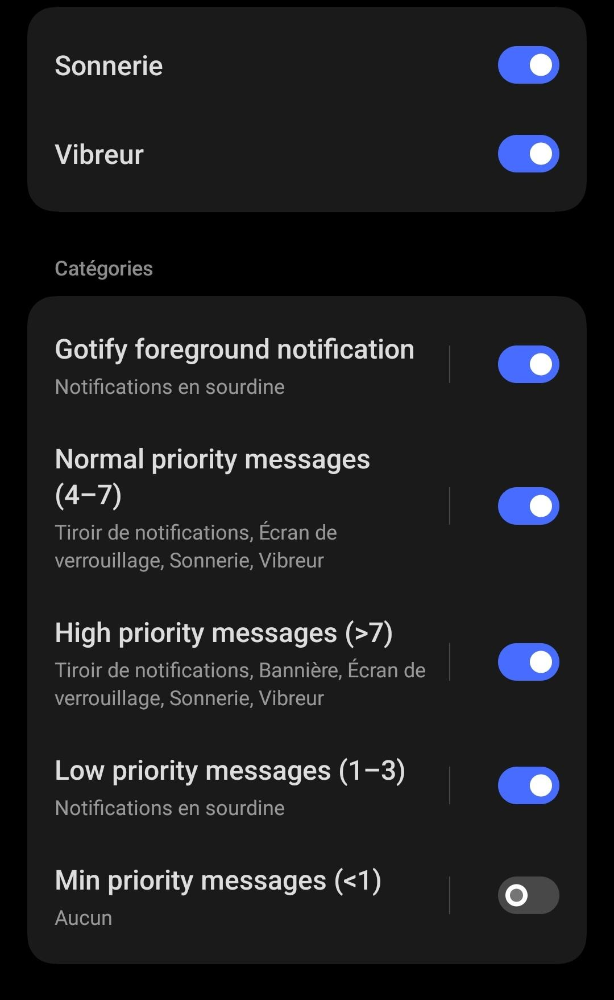

# gotify hosting playground

This repository contains a environment that allows to test [gotify/server](https://github.com/gotify/server) (a simple server for sending and receiving messages) deployment.

Deployment is powered by Docker and `docker-compose.yml` file.

I deploy this Docker image https://hub.docker.com/r/gotify/server/tags

Let's start the services:

```
$ docker compose up -d gotify --wait
```
In theory, when the shell gives up, the installation is finished,
you can go to http://127.0.0.1:8080 with your browser and enter the login / password : `admin` / `admin`.

Create a application with *curl*:

```sh
$ curl --user admin:admin -X 'POST' \
  'http://127.0.0.1:8080/application' \
  -H 'accept: application/json' \
  -H 'Content-Type: application/json' \
  -d '{
  "defaultPriority": 5,
  "description": "Test app 1",
  "name": "test-app-1"
}'
```

Get application token with *curl*:

```sh
$ export APP_TOKEN=$(curl -s -q --user admin:admin -X 'GET' http://127.0.0.1:8080/application | jq '.[] | select(.name=="test-app-1") | .token' -r)
$ echo $APP_TOKEN
AiVCm1e5mqTnQuc
```

You can install [Gotify Android](https://github.com/gotify/android) and configure it to be notified on your smartphone.
I would like to highlight the following: you can configure [the notification level (sound, vibration…)](https://github.com/gotify/android#minimize-the-gotify-foreground-notification) by message priority, for instance :



I find it very convenient to be notified only of important alerts.

Push a message to `test-app-1`:

```sh
$ curl -s -X "POST" \
  http://127.0.0.1:8080/message \
  -H "accept: application/json" \
  -H "X-Gotify-Key: ${APP_TOKEN}" \
  -H "Content-Type: application/json" \
  -d '{
  "message": "Hello world",
  "priority": 1,
  "title": "Hello"
}'

```sh
$ curl -s -X "POST" \
  http://127.0.0.1:8080/message \
  -H "accept: application/json" \
  -H "X-Gotify-Key: ${APP_TOKEN}" \
  -H "Content-Type: application/json" \
  -d '{
  "message": "Hello world",
  "priority": 10,
  "title": "Hello"
}'
